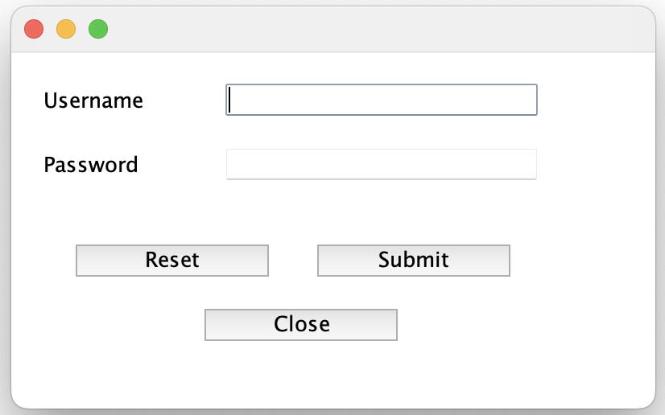
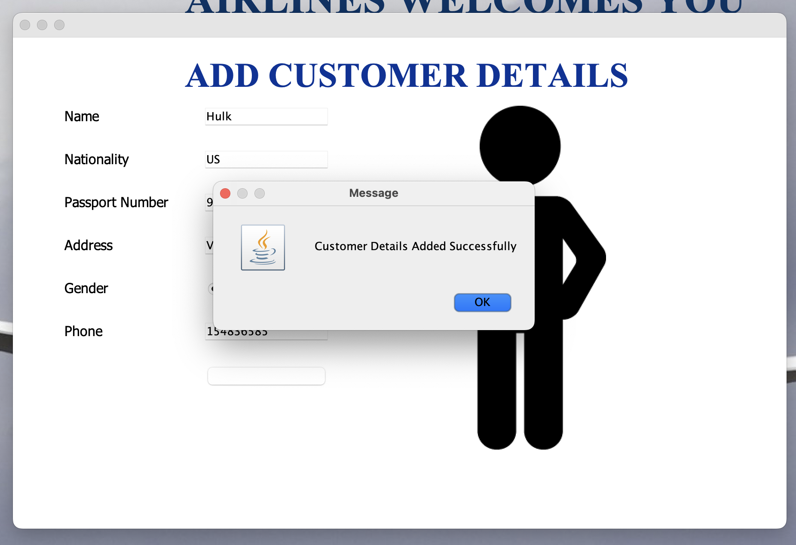
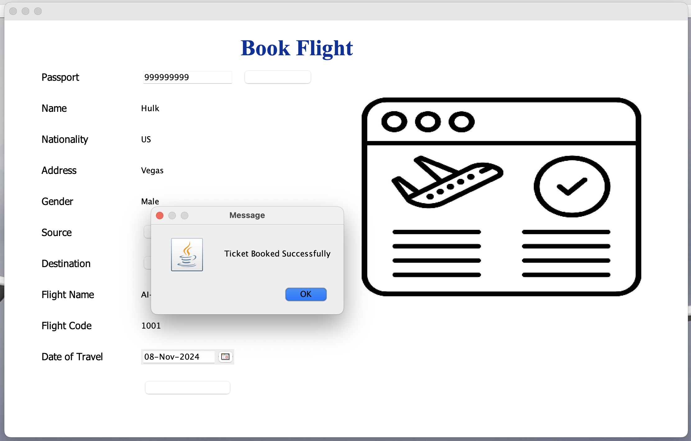
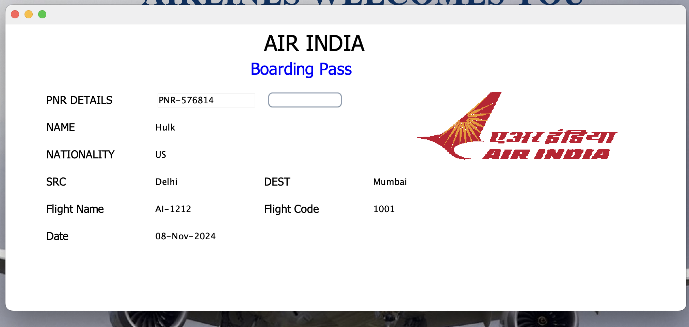
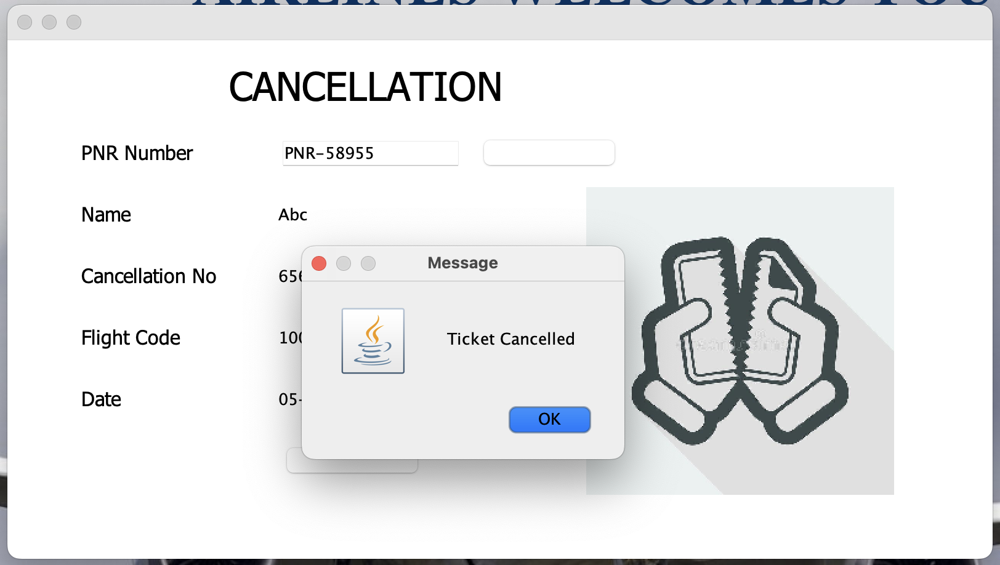

# Flight Management System

## Overview
This is a flight management system built using Java. It allows users to manage their flight bookings, including adding customers, booking flights, viewing flight information, and handling user login and registration.

## Project Screenshots

### Login Screen


### Home Page


### Add Customer Details


### Book Flight


### Boarding Pass


### Cancellation



## Features
- **Add Customer**: Allows the addition of new customer information.
- **Boarding Pass**: Manages boarding pass generation.
- **Book Flight**: Facilitates booking of flights for users.
- **Cancel Flight**: Allows users to cancel a booked flight.
- **Flight Info**: Displays flight details and availability.
- **Journey Details**: Provides information regarding journey details such as source, destination, flight code, etc.
- **Login**: Handles user authentication.

## Files
- **AddCustomer.java**: Manages the UI and logic for adding a new customer.
- **BoardingPass.java**: Manages the generation of boarding passes for customers.
- **BookFlight.java**: Provides the functionality to book flights.
- **Cancel.java**: Allows for flight cancellation functionality.
- **Conn.java**: Handles database connectivity for the system.
- **FlightInfo.java**: Displays flight information from the database.
- **Home.java**: The main dashboard of the application after login.
- **JourneyDetails.java**: Provides the details of a journey.
- **Login.java**: Manages the user login interface and authentication.

## Prerequisites
- Java Development Kit (JDK)
- MySQL Database
- Required libraries (e.g., JDBC, JDateChooser for date input)

## Database Setup
1. Create a MySQL database with the necessary tables (`login`, `flight`, `customer`, etc.).
2. Update the `Conn.java` file with your database connection details (username, password, URL).

## Running the Application
1. **Compile all Java files:**
   ```bash
   javac *.java
2. **Run the `Login.java` file to start the application:**
   ```bash
   java Login
